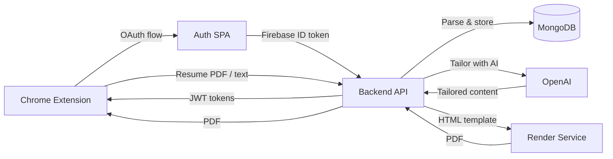

<div align="center">

# Aptio Labs

**Upload once. Tailor for every job.**

Aptio is an AI-powered resume tailoring system. Users upload their resume once and the platform generates tailored resumes and cover letters for specific job applications — delivered as a formatted PDF, directly inside the browser.

[](https://github.com/Aptio-Labs/backend)
[](https://github.com/Aptio-Labs/extension)
[](https://github.com/Aptio-Labs/backend)
[](https://github.com/Aptio-Labs/extension)
[](https://github.com/Aptio-Labs/backend)
[](https://github.com/Aptio-Labs/platform)

</div>

---

## Repositories

| Repo | Role | Stack |
|---|---|---|
| [`backend`](https://github.com/Aptio-Labs/backend) | Core API — auth, resume parsing, AI tailoring, billing, rate limiting | Python 3.13 · FastAPI · MongoDB · Redis |
| [`render-service`](https://github.com/Aptio-Labs/render-service) | PDF generation — renders HTML resume templates via headless Chromium | Python · FastAPI · Playwright |
| [`auth-spa`](https://github.com/Aptio-Labs/auth-spa) | Authentication web app — OAuth and email sign-in for the extension | React 19 · Vite · Firebase Auth |
| [`admin-web`](https://github.com/Aptio-Labs/admin-web) | Internal admin dashboard — user management, billing, rate limit config | Next.js 15 · React 19 |
| [`extension`](https://github.com/Aptio-Labs/extension) | Chrome extension — the primary user interface | React 18 · Vite · TypeScript |
| [`landing`](https://github.com/Aptio-Labs/landing) | Marketing website | Vite · TypeScript |
| [`platform`](https://github.com/Aptio-Labs/platform) | Infrastructure — Docker Compose, Terraform, observability stack | AWS · Terraform · Docker |

---

## How It Works



**User flow in brief:**
1. User installs the Chrome extension and signs in via the Auth SPA (Google OAuth or email)
2. User uploads their resume once — the backend parses it into structured JSON via OpenAI
3. On a job application page, the extension sends the job details + stored resume to the backend
4. The backend tailors the resume using AI and sends the HTML to the Render Service
5. The Render Service generates a PDF and returns it to the extension for download

---

## Local Development

All services run together via Docker Compose from the `platform` repo.

```bash
# 1. Clone all repos as siblings in one workspace
mkdir aptio-dev && cd aptio-dev
git clone git@github.com:Aptio-Labs/backend.git
git clone git@github.com:Aptio-Labs/render-service.git
git clone git@github.com:Aptio-Labs/auth-spa.git
git clone git@github.com:Aptio-Labs/admin-web.git
git clone git@github.com:Aptio-Labs/platform.git

# 2. Set up environment variables
cp backend/.env.example .env          # fill in all [REQUIRED] values
cp auth-spa/.env.example auth-spa/.env

# 3. Start the full stack
cd platform
docker compose up -d --build
```

**Service URLs once running:**

| Service | URL |
|---|---|
| Backend API | http://localhost:8000 |
| Auth SPA | http://localhost:5173 |
| Admin Dashboard | http://localhost:3002 |
| Grafana | http://localhost:3001 |
| Jaeger (tracing) | http://localhost:16686 |
| Prometheus | http://localhost:9090 |

For the Chrome extension, build it from the `extension` repo and load `dist/` as an unpacked extension in Chrome Developer mode.

---

## Branching & PR Workflow

All repos follow the same branch flow:

```
dev  ──► PR ──► staging  ──► (manual review) ──► main
```

- All work is done on `dev` or a `feat/*` branch cut from `dev`
- PRs target `staging`, never `main`
- `main` is only updated after manual review and sign-off on `staging`
- Direct pushes to `main` are blocked on all repos

---

## Tech Stack

| Layer | Technology |
|---|---|
| **AI** | OpenAI GPT-4o / GPT-4o-mini |
| **Backend** | Python 3.13, FastAPI, Beanie ODM |
| **Database** | MongoDB 7, Redis 7 |
| **Auth** | Firebase Auth (Google OAuth + Email/Password) |
| **Frontend** | React 18/19, Next.js 15, Vite, TypeScript, Tailwind CSS |
| **PDF** | Playwright + Chromium (headless) |
| **Email** | Brevo API |
| **Billing** | Flutterwave |
| **Infrastructure** | AWS EC2, ECR, SSM, DynamoDB, S3 |
| **IaC** | Terraform |
| **Observability** | Prometheus, Grafana, Jaeger (OpenTelemetry) |
| **CI/CD** | GitHub Actions, OIDC (no long-lived AWS keys) |
| **Containers** | Docker, Docker Compose |
